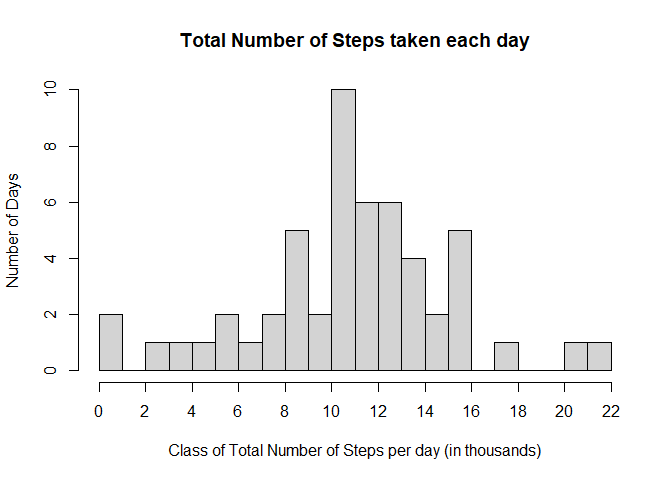
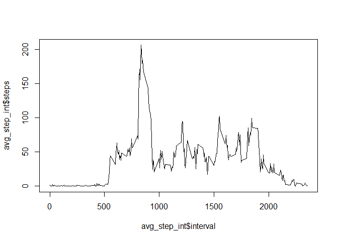
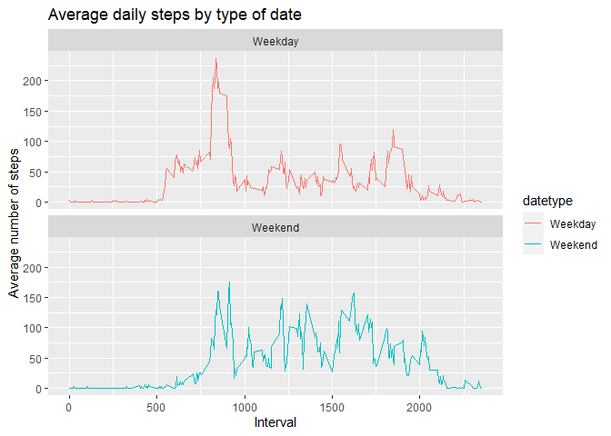

### Dependencies

R packages required for plotting.

```r
library(ggplot2)
```

## Loading and preprocessing the data

Download data from [Activity Data](https://d396qusza40orc.cloudfront.net/repdata%2Fdata%2Factivity.zip).

```r
#create a filename to store the zip file
file_name<-"Activity_Data.zip"


#download data (if not already in working directory)
if(!file.exists(file_name)){
    file_URL<-"https://d396qusza40orc.cloudfront.net/repdata%2Fdata%2Factivity.zip"
    download.file(file_URL,file_name, method="curl")
}

#unzip data
if(!file.exists("Activity_Data")){
    unzip(file_name)
}

#read data
activity_data <- read.csv("activity.csv")
```
Note that intervals are stored as first digit = hour (missing if hour = 0) next two digits are minutes (e.g. interval 835 is 08:35:00 to 08:39:59).

Preprocessing the data for analysis.

```r
#change "date" field from character to date 
activity_data$date <- as.Date(activity_data$date, "%Y-%m-%d")

#create field with day of the week and bind to new dataframe
weekday <- weekdays(activity_data$date)
activity <- cbind(activity_data,weekday)
```

## What is mean total number of steps taken per day?

Note this part of the assignment ignored the missing values in the dataset.

Calculate the total number of steps taken per day.

```r
total_steps_day<-aggregate(steps~date, activity, sum)
total_k_steps_day<-aggregate(steps/1000~date, activity, sum)
```

Plot a histogram of the total number of steps taken per day.

```r
hist(total_k_steps_day$steps, 
     xlab="Class of Total Number of Steps per day (in thousands)",
     ylab="Number of Days",
     main="Total Number of Steps taken each day",
     breaks = seq(0,22, by=1),
     ylim = c(0,10), yaxp = c(0,10,10),
     xaxp = c(0,22,11)
)
```

<!-- -->

Calculate and report the mean of the total number of steps taken per day.

```r
mean_raw<-mean(total_steps_day$steps)
mean_raw
```

```
## [1] 10766.19
```
Mean number of steps per day: 10,766.19

Calculate and report the median of the total number of steps taken per day.

```r
median_raw<-median(total_steps_day$steps)
median_raw
```

```
## [1] 10765
```
Median number of steps per day: 10,765

## What is the average daily activity pattern?

Average (mean) steps for interval.

```r
avg_step_int<-aggregate(steps~interval, activity, mean, na.rm =TRUE)

plot(avg_step_int$interval, avg_step_int$steps, type = "l")
```

<!-- -->

Check Which 5-minute interval, on average contains the maximum number of steps.

```r
avg_step_int[which.max(avg_step_int[,2]),1]
```

```
## [1] 835
```
The five minute interval containing the most number of steps is 835 (08:35).


## Imputing missing values

Calculate and report the total number of missing values (NAs) in the dataset

```r
sum(is.na(activity$steps))
```

```
## [1] 2304
```
There are 2,304 missing values (NAs) in the dataset.

Strategy for filling in (imputing) missing values: use the mean for the day of the week and the 5 minute interval (does not account for date variation).

```r
activity_manipulate <- activity
activity_manipulate$steps <- with(activity_manipulate, ave(steps, weekday, interval,
                                                           FUN = function(x) replace(x, is.na(x), mean(x, na.rm = TRUE))))
```

Plot a histogram of the total number of steps taken per day (imputed).

```r
#total steps imputed
total_steps_day_imputed<-aggregate(steps~date, activity_manipulate, sum)
total_k_steps_day_imputed<-aggregate(steps/1000~date, activity_manipulate, sum)

#histogram total steps (imputed)
hist(total_k_steps_day_imputed$steps, 
     xlab="Class of Total Number of Steps per day (in thousands)",
     ylab="Number of Days",
     main="Total Number of Steps taken each day (imputed)",
     breaks = seq(0,22, by=1),
     ylim = c(0,10), yaxp = c(0,10,10),
     xaxp = c(0,22,11)
)
```

-1.png)<!-- -->
In comparison to the non-imputed histogram, there are noticeably more days where estimated number of daily steps (thousands) is between >=9 to <10 and >=12 to <13. 


Calculate and report the mean of the total number of steps taken per day (imputed).

```r
mean_impute<-mean(total_steps_day_imputed$steps)
mean_impute
```

```
## [1] 10821.21
```
Mean number of steps per day (imputed): 10,821.21

Calculate and report the median of the total number of steps taken per day (imputed).

```r
median_impute<-median(total_steps_day_imputed$steps)
median_impute
```

```
## [1] 11015
```
Median number of steps per day (imputed): 11,015

Compare non-imputed to imputed averages: Mean.

```r
mean_diff<-(mean_impute - mean_raw)
mean_diff
```

```
## [1] 55.02092
```

```r
mean_var<-mean_diff/mean_raw
mean_var
```

```
## [1] 0.005110529
```
Mean: Absolute difference 55.02, % difference +0.51%

Compare non-imputed to imputed averages: Median.

```r
#median
median_diff<-(median_impute - median_raw)
median_diff
```

```
## [1] 250
```

```r
median_var<-median_diff/median_raw
median_var
```

```
## [1] 0.02322341
```
Median: Absolute difference 250, % difference +2.32%

Compare non-imputed to imputed totals.

```r
total_raw<-sum(total_steps_day$steps)
total_raw
```

```
## [1] 570608
```

```r
total_imputed<-sum(total_steps_day_imputed$steps)
total_imputed
```

```
## [1] 660093.8
```

```r
total_diff<-total_imputed-total_raw
total_diff
```

```
## [1] 89485.79
```

```r
total_var<-total_diff/total_raw
total_var
```

```
## [1] 0.1568253
```
With imputation, total increases by 89,485.79, or +15.68%

## Are there differences in activity patterns between weekdays and weekends?

Distinguish weekdays and weekends.

```r
activity_manipulate$datetype <- sapply(activity_manipulate$date, function(x) {
    if (weekdays(x) == "Saturday" | weekdays(x) =="Sunday") 
    {y <- "Weekend"} else 
    {y <- "Weekday"}
    y
})
```

Panel plot of steps per interval for weekday and weekend.

```r
#prepare data for plot
activity_by_week_end <- aggregate(steps~interval + datetype, activity_manipulate, mean)

#plot data
weekday_vs_weekend<- ggplot(activity_by_week_end, aes(x = interval , y = steps, color = datetype)) +
    geom_line() +
    labs(title = "Average daily steps by type of date", x = "Interval", y = "Average number of steps") +
    facet_wrap(~datetype, ncol = 1, nrow=2)

print(weekday_vs_weekend)
```

<!-- -->

Yes, there is a peak of activity on weekdays at approx. 08:00 - 09:00, with smaller peaks throughout the afternoon and evening. Weekend activity peaks are distributed approximately evenly throughout the morning, afternoon and evening.
